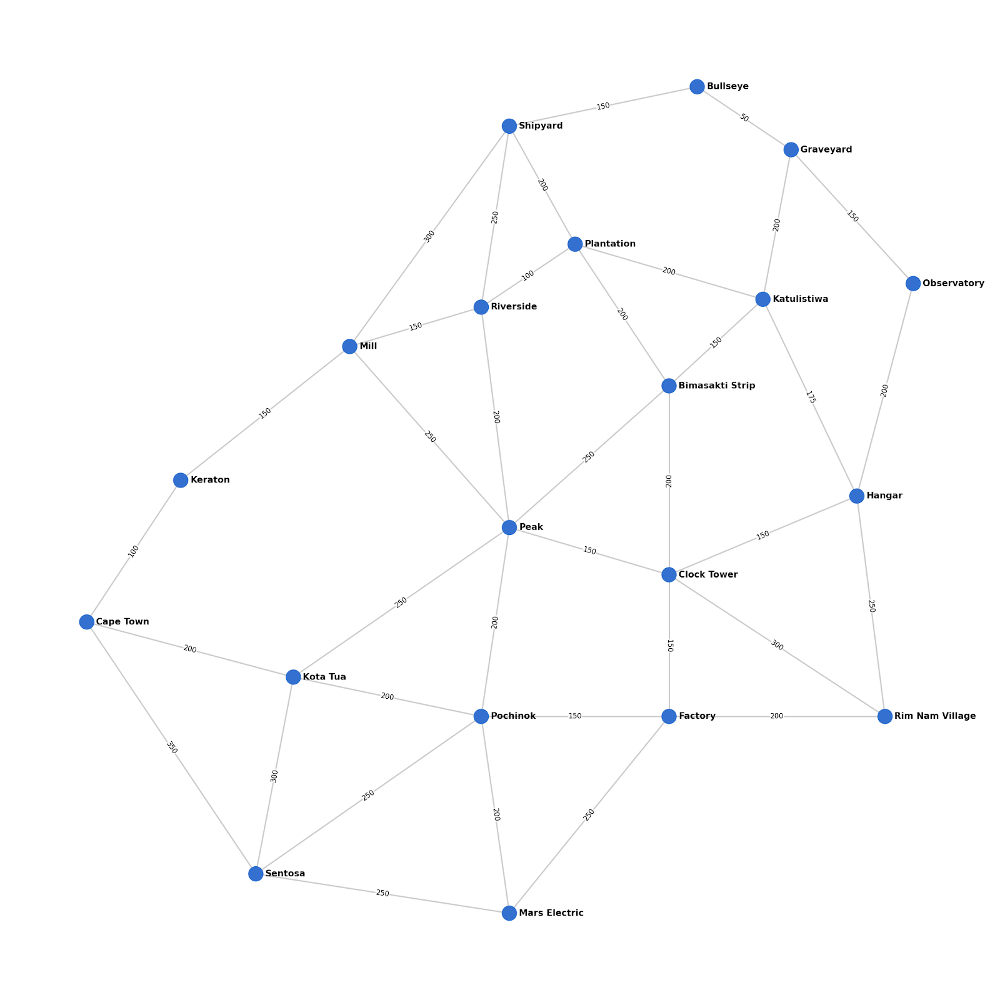

# Project Report: Project Bermuda
**Course:** Fundamentals In Artificial Intelligence And Machine Learning

---

## 1. Project Objective
The objective of this project is to develop an intelligent, utility-based pathfinding agent operating within a simulated, dynamically constrained environment. By mapping the locations of a popular battle royale game (Bermuda Map) into a logical knowledge base, the AI calculates the mathematically optimal route between a starting drop and a target destination. The system is designed to dynamically adapt to adversarial constraints, such as shifting "Red Zones" or enemy-controlled territories, recalculating the safest and shortest path on the fly.

## 2. Syllabus Mapping & Application
This project was specifically architected to demonstrate core concepts from the first two modules of the Introduction to AI syllabus:

* **Intelligent Agents & Search Strategies:** The system functions as a problem-solving agent. To ensure the absolute shortest path is found rather than just *any* path, the project utilizes an exhaustive Depth-First Search (DFS) implementation. The algorithm traverses the state space, calculates the total distance weight of every valid route, and optimizes the output by returning the path with the minimum distance cost.
* **Knowledge Representation & Logic:** Instead of using traditional graph data structures in Python, the environment is strictly modeled using **First-Order Predicate Logic** via SWI-Prolog. The map is defined through immutable `facts` (nodes and edges), while movement constraints and adversarial zones are defined using `dynamic rules`, demonstrating a deep integration of logic programming.

## 3. System Architecture
The project employs a decoupled architecture, separating the logical inference engine from the user interface to adhere to clean engineering practices.

* **The Logic Engine (SWI-Prolog):** The `map_kb.pl` file acts as the AI's brain. It stores the map's topology and houses the recursive search algorithms. Crucially, it utilizes dynamic predicates (`:- dynamic red_zone/1`) which allow the environment state to be modified at runtime without hard-coding changes into the script.
* **The Interface (Python 3):** The `tactical_route.py` script serves as the Command-Line Interface (CLI). It parses user arguments, uses the `pyswip` library to bridge the gap to the Prolog engine, injects temporary hazard constraints into the knowledge base, queries the search algorithm, and parses the logical output into a human-readable tactical summary.

## 4. Implementation Details
The core of the pathfinding relies on a custom Prolog rule utilizing the `setof` predicate. 
1. The user inputs a start and end location via the Python CLI.
2. Python injects any declared hazards (e.g., `enemy_area('Factory')`) into Prolog memory.
3. Prolog recursively explores legal steps, validating that the next node is neither a red zone nor an enemy area.
4. It compiles a list of all successful paths to the target, sorts them numerically by their calculated total distance, and returns the top result back to Python.

## 5. Critical Reflection & Future Directions
**Algorithmic Analysis:** While the current implementation guarantees the mathematically shortest path, it relies on an uninformed, exhaustive search (`setof` wrapping a DFS). Because the Bermuda map possesses a relatively small state space (~20 nodes), this brute-force optimization executes in milliseconds and is highly effective. 

However, scaling this system to a massive, real-world mapping grid (like a city network) would result in exponential time complexity and memory overflow. For future development, the logical engine should be upgraded from an Uninformed Search to an **Informed Search strategy, specifically the A* (A-Star) algorithm**. By introducing a heuristic function $h(n)$—such as the straight-line distance to the target—the agent could intelligently prune the search tree and prioritize nodes that move geographically closer to the goal, vastly improving computational efficiency on larger datasets.

## 6. Conclusion
The Tactical Map Pathfinder successfully bridges classical symbolic AI (Prolog) with modern scripting paradigms (Python). It fulfills all technical requirements of the BYOP component—including strict CLI executability—while demonstrating a firm practical grasp of knowledge representation, dynamic environments, and algorithmic search optimization.